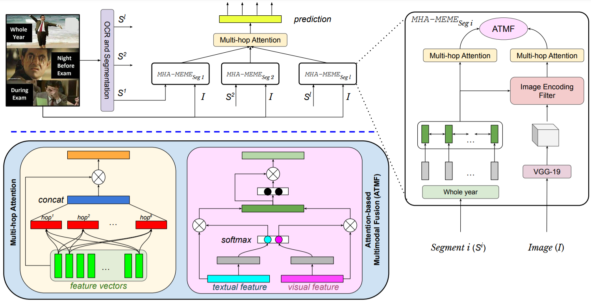

# MHA-Meme-Leveraging-Sentence-Demarcations-and-Multi-hop-Attention-for-Meme-Affect-Analysis
This repository contains the dataset and code for our ICWSM 2021 paper: Exercise? I thought you said ‘Extra Fries’: Leveraging Sentence Demarcations and Multi-hop Attention for Meme Affect Analysis. In this paper, we attempt to solve the three tasks suggested in the SemEval’20-Memotion Analysis competition. We propose a multi-hop attention-based deep neural network framework, called MHA-Meme, whose prime objective is to leverage the spatial-domain correspondence between the visual modality and various textual segments of an Internet meme to extract fine-grained feature representations for meme sentiment and affect classification. We evaluate MHA-Meme on the ‘Memotion Analysis’ dataset for all three sub-tasks - sentiment classification, affect classification, and affect class quantification. Our comparative study shows state-of-the-art performances of MHA-Meme for all three tasks compared to the top systems that participated in the competition. Unlike all the baselines which perform inconsistently across all three tasks, MHA-Meme outperforms baselines in all the tasks on average. Moreover, we validate the generalization of MHA-Meme on another set of manually annotated test samples and observe it to be consistent. Finally, we establish the interpretability of MHA-Meme.

# MHA-Meme Architecture

